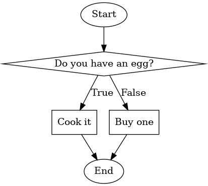
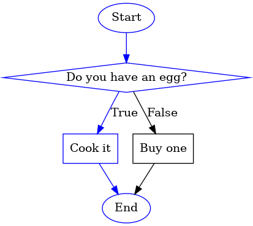
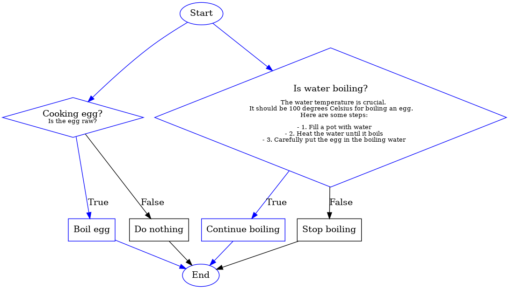

# Whoa Chart
> Executable flowcharts for humans and machines

Whoacharts is a python library that allows you to create flowcharts in python code. The flowcharts are executable, meaning that you can run them and see the flow of the program. This is useful for defining a process and seeing the each step along the way.  Each node in the flowchart is designed to be standalone, so you can run each node individually or run the entire flowchart.

## Installation

Clone the repo and `pip install .`

## Examples

Define a flow chart.

You can then run the flowchart and see the output.

Or generate more complicated flowcharts.

See examples directory for how these were generated.

