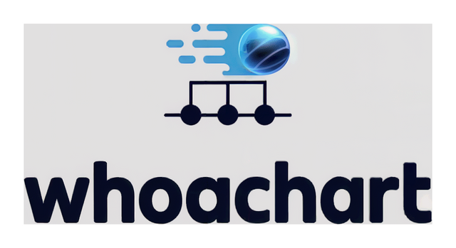

<div align="center">



**A flowchart that makes you go _whoa_.**

Watch work flow through your pipelines as live marbles rolling across a node graph — agent runs, build/test pipelines, review gates, morning triage, whatever you can describe in a little YAML.

</div>

---

## What is whoachart?

whoachart is a tiny daemon that turns a YAML **chart** into a live, visual pipeline. You define **nodes** (sources, shell steps, decisions, ends) connected by **edges**; you drop a **marble** in at the start; and whoachart animates that marble rolling through the graph as each node runs and routes it onward. It's part flowchart, part marble-diagram, part live dashboard.

- **Charts are just YAML.** A chart is a list of nodes and how they connect. Drop one in a directory and the daemon serves it.
- **Marbles are units of work.** Submit a marble with some context; it flows node-to-node. Decision nodes route it down named edges.
- **Nodes do real things.** `shell` nodes run commands; `decision` nodes branch; `source`/`end` nodes mark entry and exit.
- **Everything is live.** The browser UI streams marble positions, node logs, and outcomes as they happen.
- **It's better with [Tinstar](#better-with-tinstar).** whoachart renders each chart as a browser widget right on your multi-agent canvas.

Built to run on [Bun](https://bun.sh).

---

## Quick start

```bash
git clone https://github.com/except-pass/whoachart.git
cd whoachart
bun install

# Start the daemon (serves every chart in ./examples by default)
bun start
```

The daemon comes up on **`:5330`** and prints a UI link per chart:

```
[whoachart] daemon up on :5330 — charts: build-pipeline, agent-review, ...
[whoachart]   ui: http://localhost:5330/ui/charts/build-pipeline
```

Open that URL, then push a marble through it from another terminal:

```bash
bun run src/cli.ts submit build-pipeline --context '{"tests_pass":"yes"}'
```

Watch it roll through `ingest → build → test → shipped` in the browser.

---

## 🤖 Install with your agent (copy / paste)

Paste the block below into Claude Code (or any capable coding agent). It clones, installs, checks for Tinstar, and brings the daemon up — no further input needed.

```text
Set up the whoachart repo for me end to end:

1. Clone it and enter the directory:
   git clone https://github.com/except-pass/whoachart.git
   cd whoachart

2. Make sure Bun is installed (https://bun.sh). If `bun --version` fails,
   install it with:  curl -fsSL https://bun.sh/install | bash
   then re-open the shell so `bun` is on PATH.

3. Install dependencies:
   bun install

4. Run the tests to confirm a clean checkout:
   bun test

5. Check whether Tinstar is running (whoachart renders its charts as widgets on
   the Tinstar canvas when it's up):
   curl -sf http://localhost:5273/api/state > /dev/null \
     && echo "tinstar up — whoachart will post chart widgets to the canvas" \
     || echo "tinstar down — whoachart still works standalone in the browser"

6. Start the daemon in the background and capture its log:
   WHOACHART_CHARTS=examples bun start

7. Read back the "ui:" lines it prints and give me the chart URLs. Then submit a
   demo marble so I can see it move:
   bun run src/cli.ts submit build-pipeline --context '{"tests_pass":"yes"}'

Report the UI URLs and whether Tinstar was detected.
```

---

## Concepts

A chart is YAML. Here's the shape (see [`examples/`](examples) for full, runnable ones):

```yaml
name: build-pipeline
nodes:
  - id: ingest
    type: source            # entry point
    name: New build
  - id: build
    type: shell             # runs a command; can merge data into the marble's context
    name: Build
    description: >          # human-readable docs for what this step does
      Compiles the project and uploads build artifacts.
    doc: https://runbooks.example.com/build   # optional link to a runbook/skill
    config:
      on_enter: |
        echo "building..."
        echo '{"merge":{"built":true}}'
  - id: test
    type: decision          # emits {"next":"<edge>"} to route the marble
    name: Tests pass?
    config:
      on_enter: |
        ctx=$(cat "$WHOACHART_CONTEXT")
        echo "$ctx" | grep -q '"tests_pass":"yes"' \
          && echo '{"next":"pass"}' || echo '{"next":"fail"}'
  - id: shipped
    type: end               # terminal node
    name: Shipped
    config: { outcome: success }
```

- **source** — where marbles enter.
- **shell** — runs `config.on_enter`; emit `{"merge": {...}}` on stdout to enrich the marble's context.
- **decision** — emit `{"next": "<edge-name>"}` to choose the outgoing edge.
- **end** — terminal; records an `outcome`.

Any node can also carry **docs**, separate from the code it runs:

- **`description`** — a markdown string explaining what the step does. Surfaced in the node drawer (a "what this does" section above the code), in the canvas hover card, and in the `/def` API so an agent routing through the chart can understand each step without reading shell.
- **`doc`** — an optional link to an external runbook or skill (`http(s)` URLs become clickable in the drawer).

Routing is **node-centric**: a node decides which edge the marble takes next, so the same chart reads cleanly whether it has one path or ten.

---

## CLI

The CLI talks to a running daemon over HTTP (default port `5330`, override with `--port`).

| Command | What it does |
| --- | --- |
| `whoachart charts` | List loaded charts |
| `whoachart submit <chart> [--context json] [--workpiece path] [--start node]` | Drop a new marble into a chart |
| `whoachart marbles <chart>` | List marbles and their positions |
| `whoachart signal <chart> <marble> --next <edge> [--merge json]` | Manually advance a waiting marble |

Run via `bun run src/cli.ts <command>` (or `bun link` it as `whoachart`).

---

## Configuration

All optional — sensible defaults shown.

| Env var | Default | Purpose |
| --- | --- | --- |
| `WHOACHART_CHARTS` | `examples` | Comma-separated dirs and/or `.yaml` files to load |
| `WHOACHART_CHARTS_DIR` | (inferred) | The single writable chart-store dir for CRUD/hot-reload |
| `WHOACHART_STORE` | `./.whoachart` | Where marble/run state is persisted |
| `WHOACHART_PORT` | `5330` | Port the daemon binds |
| `WHOACHART_PUBLIC_URL` | `http://localhost:<port>` | URL browsers use to reach the daemon (set this on a tailnet/remote box — Bun binds `0.0.0.0`, so no port-forwarding needed) |
| `TINSTAR_URL` | `http://localhost:5273` | Tinstar dashboard to post chart widgets to |
| `WHOACHART_SPACE` | (none) | Confine all browser widgets to one Tinstar space and tear them down on shutdown — keeps dev/test noise off your main canvas |

---

## <a id="better-with-tinstar"></a>✨ Better with Tinstar

whoachart runs fine on its own in the browser — but it really shines next to **Tinstar**, the multi-agent dashboard.

When Tinstar is up (default `http://localhost:5273`), whoachart posts each chart as a **live browser widget directly onto the Tinstar canvas**. That means:

- **Your pipelines live where your agents live.** A chart sits on the same canvas as the agent sessions feeding it — no extra tab to babysit.
- **Spatial context.** Widgets snap into a session's constellation, so a chart visually belongs to the work that produced it.
- **Scoped, tidy dev/test.** Set `WHOACHART_SPACE` and whoachart confines its widgets to one space and cleans them up on shutdown.
- **Agent-driven, end to end.** Agents on the Tinstar canvas can submit marbles and watch their own work flow through the chart in real time.

If Tinstar isn't running, whoachart simply serves the same charts at `http://localhost:5330/ui/charts/<name>` — nothing breaks, you just don't get the canvas integration.

> Tinstar's control plane (spawning agents, editor widgets, breakout rooms, posting artifacts) is documented in its own skills; point `TINSTAR_URL` at your instance to wire whoachart in.

There's also a thin **Tinstar plugin** ([`tinstar-plugin/`](tinstar-plugin)) that adds a chart-picker accessory to the canvas so you can open any whoachart chart without leaving Tinstar.

---

## Examples

Runnable charts in [`examples/`](examples):

| Chart | What it shows |
| --- | --- |
| `marble-demo.yaml` | The basics — a marble rolling through a few nodes |
| `build-pipeline.yaml` | Build → test → ship, with a decision gate |
| `gate-demo.yaml` | Human/approval gate routing |
| `agent-review.yaml` | An agent-review pipeline lane |
| `jira-morning.yaml` | Morning Jira triage → draft → approve → post |
| `plus-one-burndown.yaml` | A burndown-style flow |

---

## Development

```bash
bun test           # run the test suite
bun start          # run the daemon
```

Teardown helper for cleaning up Tinstar widgets created by a run:

```bash
bin/whoachart-teardown
```

---

## License

See repository for license details.
