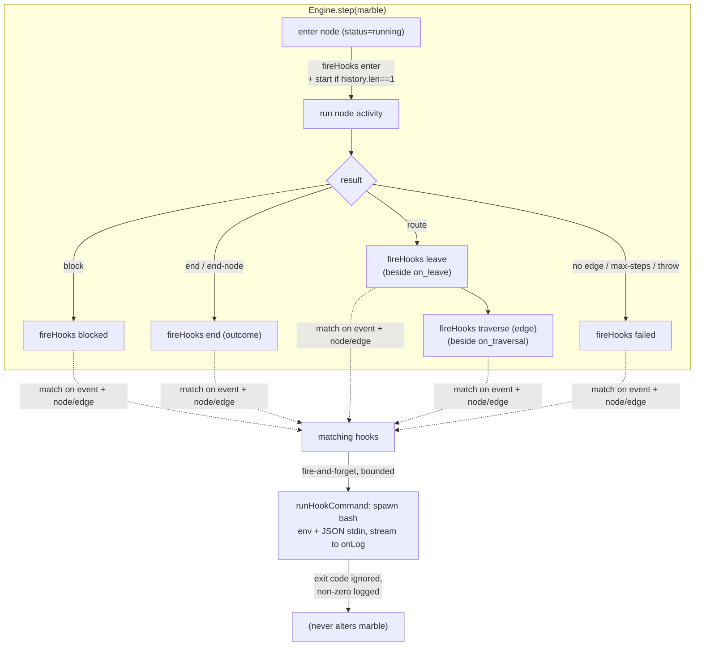

# feat: Chart-level lifecycle hooks

## Summary

Add a per-chart `hooks:` block — the Claude Code hooks model ported to whoachart.
A chart author declares, in one place, "on lifecycle event X (optionally scoped to
node/edge Y), run shell command Z." Hooks are **pure observers**: they receive the
full event + marble context (env vars **and** a JSON payload on stdin), their
output streams into the existing node-log inspector, and their exit code **never**
changes where a marble goes. Dispatch is fire-and-forget and bounded by a timeout
so a slow or hung hook cannot delay or wedge marble flow.

This extends the existing `EngineEvent` seam and reuses the `runShell`/`buildEnv`
machinery that already powers the per-node `on_leave` / per-edge `on_traversal`
inline hooks; those stay unchanged, and the `hooks:` block is the general,
multi-event, matcher-based superset.

---

## Problem Frame

whoachart already emits a rich lifecycle event stream (`src/engine.ts`
`EngineEvent`) and already runs inline `on_leave` / `on_traversal` shell hooks, but
there is **no centralized, declarative way** to react to chart activity. Today you
get side-effects only by attaching shell to individual nodes/edges one at a time,
and there is no `enter`, `start`, or `end` hook at all. A chart author who wants
"notify on every review gate", "page on-call when a decision routes down
`rejected`", or "record every completion" has to hand-edit node activities or wire
observability out-of-band.

Goal: one chart-level `hooks:` block, arbitrary shell commands, Claude-Code-faithful
payload, observational-only (never alters flow), per-chart scope only.

---

## Requirements

Traceability to `docs/brainstorms/2026-06-29-whoachart-hooks-requirements.md`:

- **R1** — top-level `hooks:` list on a chart, per-chart only (U1).
- **R2** — seven events: `start`, `enter`, `leave`, `traverse`, `blocked`,
  `failed`, `end` (U3).
- **R3** — `node:` / `edge:` matchers; bad matcher → lint warning, structural
  errors → parse failure (U1 schema, U4 lint).
- **R4** — observational only; exit code never alters routing/context/status (U3).
- **R5** — fire-and-forget, per-hook `timeout:`, bounded + non-wedging, promises
  tracked and `.catch`-guarded (U2, U3).
- **R6** — payload: existing env + `WHOACHART_EVENT`/`CHART`/`EDGE`/`FROM`/`TO`/
  `OUTCOME`, plus JSON event object on stdin (U2).
- **R7** — hook stdout/stderr streams into the per-`(marble,node)` log feed (U2,
  U3).
- **R8** — inline `on_leave` / `on_traversal` remain unchanged and independent (no
  code change; verified by regression in U3).

---

## High-Level Technical Design

Hooks dispatch through a **dedicated `fireHooks` helper** invoked at the lifecycle
sites already present in `Engine.step()` — deliberately **not** by extending the
`EngineEvent` union. Two reasons: (1) `leave` and `start` have no `EngineEvent`
equivalent (`on_leave` runs without emitting an event; `start` is a derived "first
enter"), and (2) existing tests (`tests/engineEvents.test.ts`) assert exact event
sequences, so adding members would churn the event contract for no benefit.

`fireHooks(event, marble, node, extra?)` is synchronous-dispatch / async-execute:
it selects matching hooks, kicks off each via `runHookCommand` **without awaiting**
in the marble's critical path, tracks the returned promise in an
`outstandingHooks` set, and attaches `.catch`. `Engine.drain()` awaits the
outstanding set (test/shutdown determinism); `Engine.stop()` (hot-reload quiesce)
does **not** — an in-flight observational hook may harmlessly outlive a chart swap.

---

## Key Technical Decisions

- **KTD1 — Dispatch via a helper at lifecycle sites, not via `EngineEvent`.**
  Keeps the event contract and `tests/engineEvents.test.ts` intact, and cleanly
  supports `leave` (no event) and `start` (derived). One helper, ~six call sites.

- **KTD2 — Fire-and-forget, bounded, tracked.** Hooks never block the marble's
  progression. Each run gets a timeout (per-hook `timeout:` ms, default 30000) via
  an `AbortController` that kills the bash process on overrun. Promises are tracked
  in `outstandingHooks` and always `.catch`-guarded so a failing hook can never
  surface as an unhandled rejection. `drain()` awaits them; `stop()` does not.

- **KTD3 — New `runHookCommand` in `src/context.ts`, not a `runShell` signature
  change.** Adds JSON-stdin + event-specific env without touching `runShell`'s
  existing callers (engine `on_leave`/`on_traversal`, shell/api nodes). Critically,
  it writes a **unique per-invocation** temp context file (e.g.
  `whoachart-hook-<marble>-<node>-<uuid>.json`) rather than `runShell`'s shared
  `whoachart-ctx-<marble>-<node>.json`, avoiding a read/unlink race when two hooks
  fire for the same `(marble,node)` — e.g. `enter` + `start` on the start node.

- **KTD4 — Matcher validity is a lint warning, not a parse error.** A typo'd
  `node:`/`edge:` must not reject the whole chart or break hot-reload (consistent
  with `src/lint.ts` advisory philosophy). The zod schema still hard-rejects
  structural errors (unknown `on:` value, missing `run:`, non-positive `timeout:`,
  `edge:` used with a non-`traverse` event).

- **KTD5 — `/def` exposes hook metadata but omits `run`.** Include
  `{on, node?, edge?, timeout?}` per hook in `ChartDef` so agents/inspector see
  what is hooked, but never the raw command string (which can carry secrets) —
  honoring the documented `/def` redaction trust surface (`src/context.ts`
  redaction note).

- **KTD6 — Top-level `hooks:` list mirroring `triggers:`.** More YAML-idiomatic in
  this repo than Claude Code's nested-object form; same expressive power; consistent
  with the existing `triggers:` array and its schema/validation pattern.

- **KTD7 — `start` is the first `enter` (`marble.history.length === 1`), and is
  `node:`-matchable** (matches the start node). `history` only ever grows, so this
  fires exactly once per marble and never re-fires on retry/signal re-entry.

---

## Implementation Units

### U1. Hook types + schema

**Goal:** Define the `ChartHook` shape and parse/validate it on a chart.

**Requirements:** R1, R3 (structural half), R6.

**Dependencies:** none.

**Files:**
- `src/types.ts` (modify) — add `HookEvent` union, `ChartHook` interface, `hooks?:
  ChartHook[]` on `Chart`.
- `src/schema.ts` (modify) — add `hookSchema`; add `hooks` to `chartSchema`.
- `tests/hookSchema.test.ts` (create).

**Approach:**
- `HookEvent = "start" | "enter" | "leave" | "traverse" | "blocked" | "failed" |
  "end"`.
- `ChartHook = { on: HookEvent; node?: string; edge?: string; run: string;
  timeout?: number }`.
- `hookSchema`: `on` enum (the seven), `run` required non-empty string, `node`/
  `edge` optional strings, `timeout` optional positive int. Add a `superRefine`
  rejecting `edge:` on any event other than `traverse` (matchers must be
  event-compatible). Do **not** cross-check that `node`/`edge` name a real node/edge
  here — that is U4's advisory lint job (KTD4).
- Add `hooks: z.array(hookSchema).optional()` to `chartSchema`. No `parseChart`
  cross-ref block for hooks.

**Patterns to follow:** `triggerSchema` + its `superRefine` in `src/schema.ts`;
`ChartTrigger` in `src/types.ts`.

**Test scenarios:**
- A chart with a valid `hooks:` list parses; each hook's fields round-trip.
- `on:` outside the seven values → parse throws.
- Missing/empty `run:` → parse throws.
- `timeout: 0` or negative → parse throws.
- `edge:` on a non-`traverse` event → parse throws; `edge:` on `traverse` passes.
- `node:` accepted on all node-scoped events and on `start`.
- A chart with no `hooks:` key parses unchanged (back-compat).

**Verification:** `parseChart` accepts valid hook blocks and rejects each
structural error class; `Chart.hooks` is typed.

---

### U2. Hook command runner (`runHookCommand`)

**Goal:** Spawn one hook command with the Claude-Code-faithful payload, bounded by a
timeout, streaming output line-by-line.

**Requirements:** R5 (bounded), R6 (payload), R7 (streaming).

**Dependencies:** U1.

**Files:**
- `src/context.ts` (modify) — add `runHookCommand`; export a `buildHookEnv` helper
  or extend env construction; reuse the existing `pumpStream`.
- `tests/contextHook.test.ts` (create).

**Approach:**
- Signature (directional): `runHookCommand({ script, marble, node, event, chart,
  edge?, outcome?, timeoutMs, onLine })` → `{ exitCode }`.
- Env = `buildEnv(marble, node, ctxPath)` spread, plus `WHOACHART_EVENT`,
  `WHOACHART_CHART`, and when present `WHOACHART_EDGE` / `WHOACHART_FROM` /
  `WHOACHART_TO` (traverse), `WHOACHART_OUTCOME` (end).
- **Unique** temp context path per invocation
  (`whoachart-hook-<marble>-<node>-<short-uuid>.json`) — KTD3. Write
  `marble.context` to it (`WHOACHART_CONTEXT` points at it), unlink in `finally`.
- Build the JSON event payload `{ event, chart, marble:{id,status,context,
  workpiece}, node:{id,type,name}, edge?, outcome? }` and feed it to the process on
  **stdin** (`Bun.spawn({ stdin: <bytes> })`).
- Enforce timeout internally: an `AbortController` + `setTimeout(timeoutMs)` that
  `proc.kill()`s on overrun (mirror the `signal` kill path already in `runShell`).
- Stream stdout/stderr via `pumpStream(..., onLine)` (reuse). Return `exitCode`
  only — the caller ignores it for routing (R4) and only logs non-zero.

**Patterns to follow:** `runShell` in `src/context.ts` (spawn, abort-kill, dual-pipe
drain, temp-file finally); `buildEnv`.

**Test scenarios:**
- Hook receives env vars: a script echoing `$WHOACHART_EVENT`/`$WHOACHART_NODE`/
  `$WHOACHART_CHART` produces the expected values (assert via `onLine` capture).
- Hook receives the JSON payload on stdin: a script doing `cat` / `jq` on stdin sees
  `event`, `marble.id`, and `marble.context` fields.
- `WHOACHART_EDGE`/`FROM`/`TO` present for a `traverse` invocation; `WHOACHART_OUTCOME`
  present for an `end` invocation; absent otherwise.
- A hook that `sleep`s past `timeoutMs` is killed (resolves within a bound near the
  timeout, non-zero/terminated exit) and does not hang the test.
- A hook exiting non-zero resolves with that exit code (no throw).
- Two concurrent invocations for the same `(marble,node)` both complete without a
  temp-file ENOENT race (KTD3 regression).
- `onLine` receives each stdout and stderr line.

**Verification:** `runHookCommand` returns after the process exits or is killed at
timeout; env + stdin payload match R6; output reaches `onLine`.

---

### U3. Engine dispatch (`fireHooks`) + lifecycle wiring

**Goal:** Fire matching hooks at each lifecycle site, observational and
non-blocking, tracked for drain.

**Requirements:** R2, R4, R5, R7, R8 (regression), KTD1/2/7.

**Dependencies:** U1, U2.

**Files:**
- `src/engine.ts` (modify) — add `outstandingHooks` set, a `fireHooks(event,
  marble, node, extra?)` private method, call sites in `step()`, and extend
  `drain()`.
- `tests/hooks.test.ts` (create).

**Approach:**
- `fireHooks(event, m, node, extra?)`:
  - Fast-exit if `!this.opts.chart.hooks?.length`.
  - Select hooks where `h.on === event` AND (no matcher OR matches): for node-scoped
    events match `h.node === node.id`; for `traverse` match `h.edge === extra.edge?.name`
    (and `h.node` against the `from` node if set).
  - For each, call `runHookCommand({...})` with `onLine` = the engine's `logFor(m,
    node)` sink; push the promise into `outstandingHooks`, attach `.finally(remove)`
    and `.catch(logHookError)`. Never await here.
  - On non-zero exit, `console.error` + (optionally) append a synthetic line to the
    node log — same spirit as the existing `runHook` error path.
- Call sites in `step()`:
  - after `status="running"` / enter emit: `fireHooks("enter", m, node)`, and if
    `m.history.length === 1` also `fireHooks("start", m, node)` (KTD7).
  - in the `block` branch: `fireHooks("blocked", m, node)`.
  - in the `end`/end-node branch: `fireHooks("end", m, node, { outcome })`.
  - beside `on_leave`: `fireHooks("leave", m, node)`.
  - beside `on_traversal`: `fireHooks("traverse", m, node, { edge })`.
  - at each `failed` exit (no-edge, max-steps, catch): `fireHooks("failed", m,
    nodeOrResolved)` — resolve the node defensively in the catch (it may be a bad
    id; fall back to a minimal `{id:m.node}`).
- `drain()`: after `running===0 && queue empty`, also
  `await Promise.allSettled([...outstandingHooks])` before resolving.
- Leave `stop()` untouched (hooks may outlive a quiesce harmlessly).

**Patterns to follow:** existing `runHook`, `emit`, and `logFor` in `src/engine.ts`;
the `step()` lifecycle branches.

**Test scenarios:**
- Linear run (`source → end`) with an unmatched-by-default `enter` hook fires once
  per node entered; payload node ids correct.
- `start` hook fires exactly once (at the source), not on later nodes; survives a
  multi-node chart.
- `node:`-scoped `enter` hook fires only for that node; others don't trigger it.
- `traverse` hook with `edge: <name>` fires only when that named edge is taken (use
  a decision routing down two edges; assert only the matching one fires).
- `blocked` hook fires when a marble blocks at a waiter node; `end` hook fires with
  `outcome` on completion; `failed` hook fires when routing finds no edge.
- **Observational guarantee:** a hook that exits non-zero (and one that writes
  garbage to stdout) leaves the marble's `history`/`status`/`context` byte-identical
  to a no-hooks run (snapshot compare).
- **Non-blocking:** a hook that sleeps does not delay the marble reaching `end`
  (marble completes well before the hook's timeout; assert ordering via timestamps
  or a completion latch).
- `drain()` resolves only after outstanding hooks settle (a slow hook is awaited by
  drain).
- A throwing/failing hook never produces an unhandled rejection (process-level
  guard / no test crash).
- **R8 regression:** inline `on_leave` and `on_traversal` still run and still
  await-in-flow when both they and `hooks:` are present.

**Verification:** every event fires the right hook with correct matcher scoping;
marble flow is identical with and without hooks; drain settles hooks.

---

### U4. Lint matcher checks

**Goal:** Advisory warnings for hook matchers that name a non-existent node/edge.

**Requirements:** R3 (advisory half).

**Dependencies:** U1.

**Files:**
- `src/lint.ts` (modify) — add hook-matcher checks to `lintChart`.
- `tests/lint.test.ts` (modify).

**Approach:**
- After the existing node/edge checks, iterate `chart.hooks ?? []`: if `h.node` is
  set and not in the node-id set → `warn` code `hook-unknown-node`; if `h.edge` is
  set and no edge has that `name` → `warn` code `hook-unknown-edge`. Pin the warning
  to the node/edge for click-through where possible.
- Keep findings in `warnings` (no blocking tier).

**Patterns to follow:** `danglingEdge` + the per-node oddity checks in `src/lint.ts`;
existing `LintWarning` codes.

**Test scenarios:**
- Hook `node:` naming a missing node → one `hook-unknown-node` warning.
- Hook `edge:` naming a missing edge name → one `hook-unknown-edge` warning.
- Hook with no matcher, or matchers that resolve → no hook warnings.
- Valid chart with valid hooks → lint clean of hook codes.

**Verification:** `lintChart` surfaces typo'd matchers as warnings without throwing;
`/def` `lint` key reflects them (re-linted per request).

---

### U5. `/def` exposure (redacted)

**Goal:** Surface hook metadata in `ChartDef` without leaking the `run` command.

**Requirements:** R-derived (transparency vs. secret-leak), KTD5.

**Dependencies:** U1.

**Files:**
- `src/daemon.ts` (modify) — add a redacted `hooks` array to the `def()` payload.
- The `ChartDef` type declaration (locate: `src/daemon.ts` or `src/controlApi.ts`)
  (modify) — add the `hooks` field.
- `tests/daemonHooks.test.ts` (create) or extend an existing daemon/def test.

**Approach:**
- In `def()`, map `rt.chart.hooks` to `{ on, node?, edge?, timeout? }` — **omit
  `run`** entirely (do not even emit a redacted placeholder string that could be
  mistaken for the command).
- Add `hooks?: Array<{on; node?; edge?; timeout?}>` to `ChartDef`.

**Patterns to follow:** the `triggers: rt.chart.triggers` pass-through and the
`redactSecrets(n.config)` treatment in `src/daemon.ts` `def()`.

**Test scenarios:**
- A chart with hooks: `/def` (or `daemon.def(name)`) includes `hooks` with
  `on`/matcher/`timeout` and **no** `run` field for any entry.
- A chart without hooks: `hooks` omitted/empty, existing `def` shape unchanged.

**Verification:** `def()` never returns a hook `run` string; metadata present.

---

### U6. Docs + example chart

**Goal:** Document the feature and ship a runnable example.

**Requirements:** R1–R7 (user-facing surface).

**Dependencies:** U1–U3.

**Files:**
- `README.md` (modify) — a "Hooks" section: the seven events, matcher rules, env +
  JSON-stdin payload table, observational/timeout semantics, relation to inline
  `on_leave`/`on_traversal`.
- `examples/hooks-demo.yaml` (create) — a small chart exercising `start`, an
  `enter` with a `node:` matcher, a `traverse` with an `edge:` matcher, and `end`,
  each running a harmless `echo`/append.

**Approach:** Mirror the README `triggers:` section's depth and the existing example
charts' style. Keep example commands side-effect-light (write to a temp log / echo).

**Patterns to follow:** the triggers/automation section of `README.md`;
`examples/automation-demo.yaml`.

**Test scenarios:** Test expectation: none — docs + example. (Optional sanity: a
test that `parseChart` accepts `examples/hooks-demo.yaml`, alongside any existing
"all examples parse" test if present.)

**Verification:** README documents the full contract; `examples/hooks-demo.yaml`
parses and runs end-to-end under the daemon.

---

## Scope Boundaries

**In scope:** per-chart `hooks:` block; seven lifecycle events; `node`/`edge`
matchers; observational fire-and-forget execution with per-hook timeout; env +
JSON-stdin payload; output streaming into the node log; advisory lint;
redacted `/def`; docs + example.

### Deferred to Follow-Up Work
- **Blocking / veto / context-mutating hooks.** Observational only here; the
  exit-code/payload contract is left clean so a future opt-in `blocking: true`
  could add veto power without a breaking change.
- **Global / daemon-level hooks** (Claude Code's user/project/local settings
  hierarchy). Per-chart only — no current use case for a whoachart-global hook
  (confirmed in brainstorm).
- **Rich hooks UI** (a node-drawer "hooks attached" indicator). Output already
  streams into the existing node-log inspector.
- **Templating in `run:`** beyond shell env interpolation. No new mini-language.

---

## Risks & Dependencies

- **Temp-file race (addressed):** two hooks for the same `(marble,node)` would race
  on `runShell`'s shared context path; mitigated by the unique per-invocation path
  in U2/KTD3. Test enforces it.
- **Hung hook:** mitigated by the mandatory per-hook timeout (default 30s) that
  kills the process; `drain()` bounds shutdown wait to the slowest timeout.
- **Event-contract churn:** avoided by dispatching outside the `EngineEvent` union
  (KTD1) — `tests/engineEvents.test.ts` must remain green (regression gate).
- **Secret leakage via `/def`:** avoided by omitting `run` (KTD5). Hook **stdout**
  is still un-redacted in the node-log feed — same loopback+Tailscale trust-surface
  caveat already documented for `runShell` output; no regression, noted not fixed.
- **Unhandled rejection from a failing hook:** avoided by the tracked-promise
  `.catch` guard (KTD2).

---

## Verification Strategy

- Unit: `tests/hookSchema.test.ts`, `tests/contextHook.test.ts`,
  `tests/lint.test.ts` (additions), `tests/daemonHooks.test.ts`.
- Behavioral/integration: `tests/hooks.test.ts` drives a real `Engine` over real
  charts and asserts firing, matcher scoping, the observational guarantee, and
  drain settling.
- Regression: full `bun test` green, with explicit attention to
  `tests/engineEvents.test.ts` (event contract unchanged) and any existing
  `on_leave`/`on_traversal` coverage.
