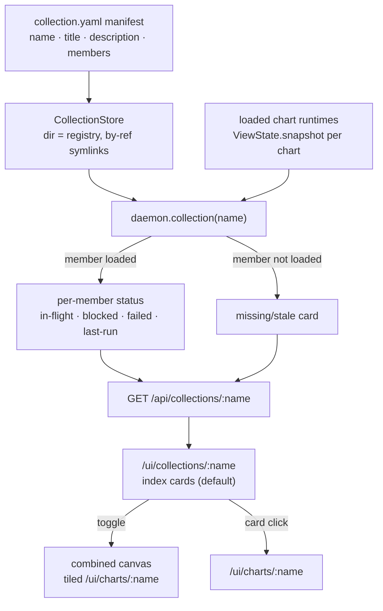

# feat: Chart Collections

## Summary

Add a first-class **Collection**: a named set of thematically-related charts declared in a thin manifest (`collection.yaml` → `name`, `title`, `description`, ordered member chart references). The daemon discovers and serves collections; a collection gets a landing page that shows each member chart as a card with live status (in-flight / blocked / failed counts, last run), and a toggle that expands into a combined canvas where every loaded member's node-graph animates live together. Collections **describe** charts they reference; they do not load them.

---

## Problem Frame

A daemon already serves many charts at once, but each is an island reachable only at `/ui/charts/:name`, with no surface that says "these N charts are one thing." SREna lives this gap: ~10 charts (`prod-health-sweep`, the `pdca-*` loop, the health sweeps, `serena-heartbeat`) are symlinked into one chart dir and run under `WHOACHART_SPACE=_srena`, related only by operator convention. Answering "is the SRE operating loop healthy right now?" means opening charts one at a time and reassembling the picture by hand. The missing thing is an identity and a single view for the set — not new behavior inside any chart.

---

## Key Technical Decisions

**KTD1. A Collection is a thin by-reference manifest, served from its own store dir.** `parseCollection` mirrors `parseChart` (zod, validate-at-parse-time per AGENTS.md), producing `{ name, title, description, members: string[] }` where `members` are chart names. Manifests live in a dedicated `WHOACHART_COLLECTIONS_DIR` served by a `CollectionStore` that mirrors `ChartStore` (`src/chartStore.ts`): same `assertSafeName` traversal guard, `atomicWrite`, register-by-value (`write`) and register-by-reference (`link`) paths, disk-is-the-registry (no side index). A separate dir keeps manifests out of the chart boot loop — a `collection.yaml` dropped into the chart dir would otherwise be parsed as a chart and land in `bootErrors`. (see origin: KTD "Collection identity lives in a thin manifest")

**KTD2. Per-member status is derived from existing daemon state — no new telemetry.** `daemon.snapshot(name)` already returns `ViewSnapshot { live, ends, stats, deadLetter }` (`src/view/viewState.ts`). A card's counts come straight from it: in-flight = `live.length`, blocked = `live.filter(status === "blocked").length`, failed = `deadLetter.length`, last-run from `ends` recent tallies. This satisfies R7/R10 against the assumption in the origin doc that no per-marble telemetry is required.

**KTD3. Collections describe, not load.** `daemon.collection(name)` composes the manifest's member list against currently-loaded runtimes. A member naming a chart not in `runtimes` is returned in a `missing` state (R4/R8) rather than triggering a load or erroring the collection. The collection axis stays orthogonal to chart loading and to `WHOACHART_SPACE`. (see origin: KTD "Collections describe; they do not load")

**KTD4. The combined canvas reuses the per-chart page by tiling, not by rewriting the renderer.** `app.js` is a single-chart client keyed on `globalThis.WHOACHART.chart`, drawing from each chart's `/def` + `/state`. For v1 the canvas tiles existing `/ui/charts/:name` views (each already polls its own `/state`, so marbles animate live for free) — lowest-risk reuse of the renderer per R11/R12. A shared multi-graph renderer (one SVG, N graphs) is deferred to follow-up.

**KTD5. Writes are loopback-only, reads follow the base trust gate.** Collection register/reload routes pass through the existing `writeGate` (loopback-absolute) exactly like chart writes; index/status reads sit behind the base trust gate (loopback + Tailscale) like `/api/charts`. No new trust surface. (see origin: Dependencies/Assumptions "loopback + Tailscale")

---

## High-Level Technical Design

A collection is a source-of-truth fan-out: one manifest feeds one composed status object, which feeds both display surfaces. Per-member status is pulled live from each chart's existing `ViewState`; nothing is duplicated into the collection layer.



*Directional guidance, not implementation specification.*

---

## Output Structure

New files this plan introduces (existing files modified in place are listed per-unit):

```
src/
  collectionSchema.ts        # parseCollection + Collection type (U1)
  collectionStore.ts         # CollectionStore (U2)
  ui/
    collectionPage.ts        # renderCollectionPage shell (U5)
    public/
      collection.js          # index-card client + canvas toggle (U5, U6)
tests/
  collectionSchema.test.ts   # U1
  collectionStore.test.ts    # U2
  collections.test.ts        # U3 + U4 (daemon + control API)
```

---

## Requirements Traceability

| Origin requirement | Covered by |
|---|---|
| R1–R3, R5 (manifest shape, by-reference, order) | U1 |
| R2 (parse-time validation) | U1 |
| R4, R8 (missing member tolerated) | U3, U5 |
| R6, R7, R9, R10 (index page, status, links, poll cadence) | U4, U5 |
| R11–R13 (combined canvas, opt-in toggle) | U6 |
| R14, R15 (serve + discover, register-by-reference, restart-survival) | U2, U3, U4 |

---

## Implementation Units

### U1. Collection schema and parse/validate

**Goal:** A `Collection` type and `parseCollection(text)` that validates a manifest at parse time, rejecting bad input before any runtime use.
**Requirements:** R1, R2, R3, R5.
**Dependencies:** none.
**Files:** `src/collectionSchema.ts` (new), `src/types.ts` (add `Collection`), `tests/collectionSchema.test.ts` (new).
**Approach:** Mirror `parseChart` in `src/schema.ts` — a zod schema with `name` (constrained string), `title`, `description`, and `members: string[]` (chart-name references, min length 1 per "1 or more charts"). Preserve member order verbatim (no sort) for R5. Validation throws the same shape `parseChart` does so the control API maps it to a 400. Member names are references only — never embedded chart definitions (R3).
**Patterns to follow:** `parseChart` / zod usage in `src/schema.ts`; the validate-at-parse-time invariant in AGENTS.md.
**Test scenarios:**
- Valid manifest with three members parses; `members` array preserves declared order C, A, B (not sorted). *Covers R5.*
- Missing `name` / missing `title` / `members` not an array → rejected at parse time. *Covers R2.*
- Empty `members` list → rejected (a collection is 1+ charts).
- A member entry that is a non-string (object/number) → rejected. *Covers R3.*
- `description` present and arbitrary text is accepted unchanged.
**Verification:** `bun test tests/collectionSchema.test.ts` green; `bunx tsc --noEmit` clean.

### U2. CollectionStore — manifest registry

**Goal:** A server-owned directory of `collection.yaml` manifests with the same registry semantics as `ChartStore`, so collections survive restarts and support register-by-reference.
**Requirements:** R14, R15.
**Dependencies:** U1.
**Files:** `src/collectionStore.ts` (new), `tests/collectionStore.test.ts` (new).
**Approach:** Mirror `src/chartStore.ts`: a `CollectionStore(dir)` with `init`, `path`, `resolvePath`, `listNames`, `exists`, `read`, `write` (atomic, by-value), and `link` (by-reference symlink). Reuse `assertSafeChartName`'s traversal guard (extract/rename to a shared `assertSafeName` or reuse as-is) and the shared `atomicWrite`/`writeTarget` helpers already exported from `src/chartStore.ts` rather than duplicating them. Disk is the registry — no side index. The dedicated dir (KTD1) keeps manifests out of the chart boot loop.
**Patterns to follow:** `ChartStore` in `src/chartStore.ts` end-to-end, including the `.yaml`/`.yml` resolution and symlink-following.
**Test scenarios:**
- `write` then `read` round-trips a manifest; `listNames` reports it.
- `link` to an external path makes the collection discoverable via `listNames`/`read` (by-reference). *Covers R15.*
- A traversal name (`../evil`) is rejected by the safe-name guard before any fs op.
- `exists` is false for an unknown name, true after `write`.
**Verification:** `bun test tests/collectionStore.test.ts` green.

### U3. Daemon collection wiring — load, compose status, register/reload

**Goal:** The daemon discovers collections at boot and exposes `collections()` and `collection(name)`, the latter composing each member's live status (or a missing state) from existing runtimes.
**Requirements:** R4, R8, R14, R15.
**Dependencies:** U1, U2.
**Files:** `src/daemon.ts` (boot loop, `collectionStore` field, `collections`/`collection`/`registerCollection`/`loadNewCollections` methods), `src/main.ts` (wire `WHOACHART_COLLECTIONS_DIR`), `tests/collections.test.ts` (new, shared with U4).
**Approach:** Add a `CollectionStore` to the daemon when `WHOACHART_COLLECTIONS_DIR` is set (mirrors the `chartStore` guard returning 501 when unconfigured). At boot, `listNames` → parse each manifest, isolating failures into a `bootErrors`-style record so one bad manifest can't sink boot (mirror `bootLoad`). `collection(name)` returns `{ name, title, description, members: [...] }` where each member is `{ name, status }` — `status` from `daemon.snapshot(member)` reduced to in-flight/blocked/failed/last-run when the member is in `runtimes`, or `{ missing: true }` when it is not (R4/R8). `registerCollection` / `loadNewCollections` mirror `registerChart` / `loadNewCharts` (serialized via the existing `mutate()` lock, 409 on duplicate, by-value and by-reference).
**Patterns to follow:** chart boot loop and `bootLoad` (`src/daemon.ts:281`), `registerChart`/`registerChartByPath`/`loadNewCharts` (`src/daemon.ts:494+`), `snapshot` (`src/daemon.ts:885`).
**Test scenarios:**
- A registered collection with all members loaded → `collection()` returns each member with derived counts matching that chart's snapshot. *Covers R14.*
- A member naming an unloaded chart → that member returns `missing: true`; the other members return normally; the call does not throw. *Covers AE1, R4, R8.*
- Member status reflects live state: a chart with two running + one blocked marble reports in-flight 2, blocked 1. *Covers AE2, R7.*
- A malformed manifest at boot is isolated (recorded, not fatal); other collections still load.
- `registerCollection` of a duplicate name → 409; `loadNewCollections` brings a newly-dropped manifest live without restart. *Covers R15.*
- `collection()`/`registerCollection` with no collections dir configured → 501.
**Verification:** `bun test tests/collections.test.ts` green; `bunx tsc --noEmit` clean.

### U4. Control API routes for collections

**Goal:** HTTP surface for listing collections, reading a collection's composed status, registering/reloading manifests, and serving the index page shell.
**Requirements:** R6, R7, R9, R10, R14, R15.
**Dependencies:** U3.
**Files:** `src/controlApi.ts`, `tests/collections.test.ts`.
**Approach:** Add routes mirroring the chart routes in `src/controlApi.ts`:
- `GET /api/collections` → `{ collections: daemon.collections() }`.
- `GET /api/collections/:name` → `daemon.collection(name)` (404 unknown).
- `POST /api/collections` → register by-value (raw YAML) or by-reference (`{path}` JSON), behind `writeGate` (loopback-only), 201.
- `POST /api/collections/reload` → `daemon.loadNewCollections()`, behind `writeGate`.
- `GET /ui/collections/:name` → `renderCollectionPage(name)` (404 when `daemon.collections()` excludes it), with the same trailing-slash canonical redirect the chart UI route uses.
Reads stay on the base trust gate; writes use `writeGate`. Errors map through the existing `ChartError`/`FormError` handling.
**Patterns to follow:** the `/ui/charts/:name`, `/api/charts`, `POST /api/charts`, and `POST /api/charts/reload` blocks in `src/controlApi.ts`; `writeGate` usage.
**Test scenarios:**
- `GET /api/collections` lists registered collections.
- `GET /api/collections/:name` returns composed member status; unknown name → 404.
- `GET /ui/collections/:name` returns HTML for a known collection; unknown → 404; trailing slash → 301 to slashless. *Covers R6.*
- `POST /api/collections` from a non-loopback peer → 403 (writeGate); from loopback → 201. *Covers R14, R15.*
- `POST /api/collections/reload` picks up a dropped manifest. *Covers R15.*
**Verification:** `bun test tests/collections.test.ts` green.

### U5. Index UI — member cards with live status

**Goal:** The default collection surface: a landing page showing title/description and one card per member in manifest order, each with live status and a link into the full chart, refreshing on the existing poll cadence.
**Requirements:** R6, R7, R8, R9, R10, R5.
**Dependencies:** U4.
**Files:** `src/ui/collectionPage.ts` (new shell), `src/ui/public/collection.js` (new client), `src/ui/static.ts` (serve the new asset if the static server enumerates assets), `tests/collections.test.ts` (route-level assertions; card rendering is client JS).
**Approach:** `renderCollectionPage(name)` mirrors `renderPage` in `src/ui/page.ts` — same dark shell/styling, sets `globalThis.WHOACHART = { collection: name }`, loads `collection.js`. The client fetches `/api/collections/:name`, renders a card per member in array order (R5) showing name, in-flight/blocked/failed counts and last-run (R7); a `missing: true` member renders a distinct stale/missing card rather than being omitted (R8); each card links to `/ui/charts/:name` (R9). Poll on the same interval the existing UI uses (~600ms, the cadence noted in prior UI work) — no new transport (R10). Keep the framework-free vanilla-JS, self-injecting-DOM style of `viewport.js`/`legend.js`.
**Patterns to follow:** `renderPage` shell (`src/ui/page.ts`), the existing poll loop in `src/ui/public/app.js`, the self-contained module style of `src/ui/public/viewport.js` and `legend.js`.
**Test scenarios:**
- Route returns the shell with the collection name injected (`/ui/collections/:name`). *Covers R6.*
- (Client) given an API payload with three loaded + one missing member, four cards render, the missing one in the stale state, in declared order. *Covers AE1, AE3, R5, R8.*
- (Client) counts update on the next poll without a full reload. *Covers AE2, R10.*
- (Client) a card click navigates to `/ui/charts/:name`. *Covers R9.*
**Test expectation:** route-level tests in `tests/collections.test.ts`; client-DOM scenarios are described for the implementer to cover with the project's existing client-test approach, or via a thin DOM harness if none exists.
**Verification:** `bun test` green; manual: open `/ui/collections/<name>` and confirm cards + status.

### U6. Combined canvas — opt-in tiled live view

**Goal:** A toggle on the index that expands into a combined canvas rendering every loaded member's node-graph together with marbles animating live; collapse returns to the index.
**Requirements:** R11, R12, R13.
**Dependencies:** U5.
**Files:** `src/ui/public/collection.js` (extend with canvas mode), `src/ui/collectionPage.ts` (toggle control in the shell).
**Approach:** Default surface is the index (R13); a toggle switches to canvas mode. v1 tiles the existing `/ui/charts/:name` page per loaded member in a responsive grid / pan-zoom container (KTD4) — each tile is the full per-chart renderer already polling its own `/state`, so marbles animate live across all members (R12). Missing members are omitted from the canvas (no chart to render) while still showing on the index. Toggling back restores the index without a page reload.
**Patterns to follow:** the canvas/viewport conventions in `src/ui/public/viewport.js`; the existing chart page as the embedded unit.
**Test scenarios:**
- (Client) toggle from index → canvas renders one tile per loaded member in manifest order; toggle back restores the index. *Covers R11, R13, AE3.*
- (Client) a member with live marbles shows animation in its tile (live `/state` polling reaches the embedded view). *Covers R12.*
- (Client) the canvas is not shown until the toggle is used (index is the default). *Covers R13.*
**Test expectation:** client-DOM scenarios as in U5; the canvas is presentational over already-tested data routes.
**Verification:** `bun test` green; manual: expand the canvas on `/ui/collections/<name>` and watch member graphs animate.

---

## Scope Boundaries

Carried from origin (`docs/brainstorms/2026-06-30-chart-collections-requirements.md`).

### Deferred for later
- **Multi-membership as working behavior.** The by-reference design does not preclude a chart appearing in two manifests, but v1 does not enforce single-membership, de-dup overlap, or handle a chart on two collection indexes.
- **Collection-level acting on gates** (approving/blocking marbles across members from the collection view).
- **Shared multi-graph renderer** (one SVG, N graphs) replacing the v1 iframe/tile reuse in U6.

### Outside this product's identity
- **Collection-level automation** (triggers, hooks, supervisor spanning members) — automation stays chart-level; a collection adds no runtime behavior.
- **Cross-chart marble hand-off** (chart A's end feeding chart B's source) — a collection is not an execution graph.

### Deferred to Follow-Up Work
- Migrating the SREna `_srena` set to a real `collection.yaml` (a consumer change in the SREna repo, not this repo).
- `WHOACHART_WATCH`-style fs.watch auto-pickup for manifests (mirror the chart watch path) once the reload route lands.

---

## Dependencies / Assumptions

- Builds on the existing `ChartStore` / register-by-reference pattern and the per-chart `ViewState.snapshot()`; no new persistence layer.
- Per-member status is fully derivable from `daemon.snapshot(name)` — no new per-marble telemetry (validated against `src/view/viewState.ts`).
- The existing UI poll cadence is sufficient for index liveness; no SSE/websocket is added.
- `WHOACHART_COLLECTIONS_DIR` is the new env knob; collections are disabled (501) when unset, mirroring `WHOACHART_CHARTS_DIR`.
- The collection axis is orthogonal to `WHOACHART_SPACE`.

---

## Open Questions

### Deferred to Planning-time decisions already made
- Manifest store location: **dedicated `WHOACHART_COLLECTIONS_DIR`** (KTD1) to avoid the chart boot loop parsing manifests as charts.

### Deferred to Implementation
- Whether `assertSafeChartName` is reused as-is or renamed to a shared `assertSafeName` (cosmetic; reuse in place is fine).
- Exact "last-run" indicator semantics on a card (timestamp vs status vs both) — settle against `ViewSnapshot.ends` shape during U5.
- Whether U6 tiling uses iframes or in-page embeds of the per-chart renderer — decide during U6 against how `app.js` scopes `globalThis.WHOACHART`; iframe is the safe default.
- Whether the project has an existing client-JS test harness for U5/U6 DOM scenarios or one should be added thinly.

---

## Sources & Research

- Origin requirements: `docs/brainstorms/2026-06-30-chart-collections-requirements.md`.
- Chart registry + by-reference pattern to mirror: `src/chartStore.ts`.
- Per-chart status source: `src/view/viewState.ts` (`ViewSnapshot`), exposed via `daemon.snapshot` (`src/daemon.ts:885`).
- Route patterns to mirror: `src/controlApi.ts` (`/ui/charts/:name`, `/api/charts`, `POST /api/charts`, `/api/charts/reload`, `writeGate`).
- UI shell + framework-free client conventions: `src/ui/page.ts`, `src/ui/public/{app,viewport,legend}.js`.
- Daemon boot/register/reload: `src/daemon.ts` (`bootLoad`, `registerChart`, `loadNewCharts`).
