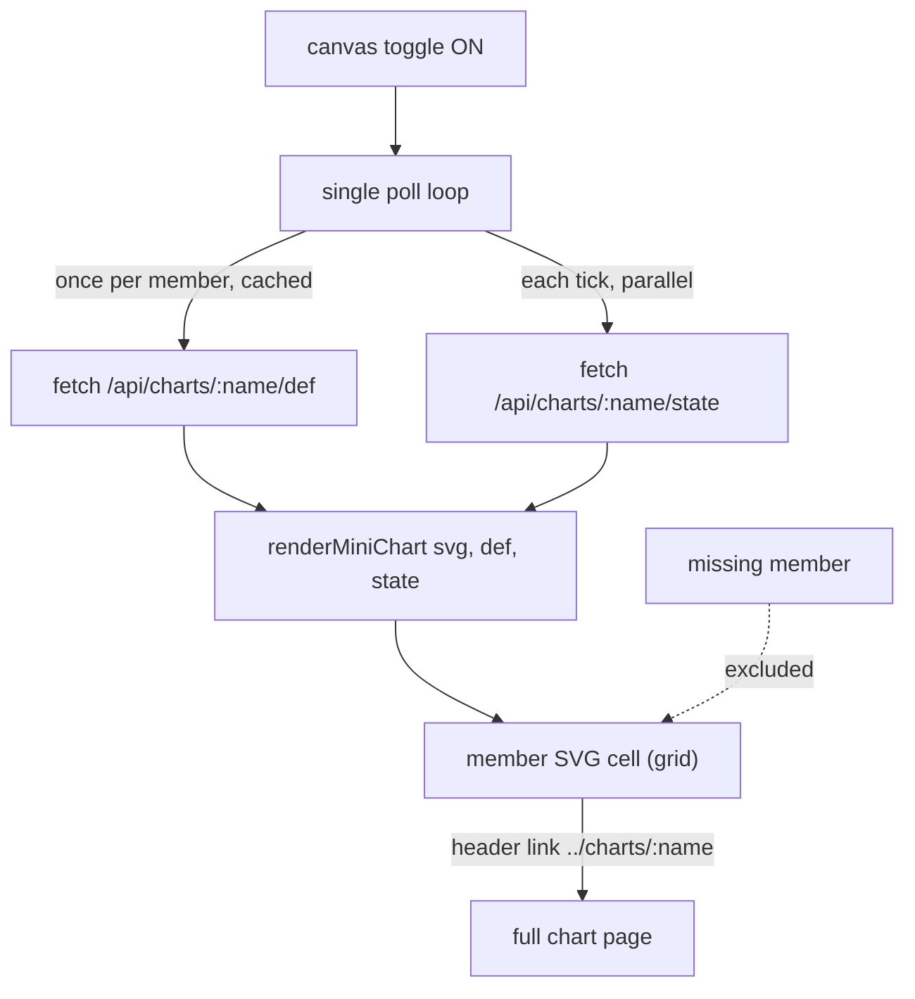

# refactor: Chart-collection canvas — single-page multi-graph renderer

## Summary

Replace the chart-collection combined canvas's iframe-tiling with an **in-page multi-graph renderer**. Instead of embedding one `<iframe>` per member chart (each a full whoachart app), the collection page draws every loaded member's node-graph as inline SVG in a responsive grid, fed by `/def` (topology, fetched once) and `/state` (live marbles, polled) over root-relative fetch — the proxy-safe path. One poll loop refreshes all members. This kills both shipped failure modes: nested chart-page-in-iframe-in-Tinstar-proxy (which booted a Tinstar canvas per tile) and N full live apps at once (the 12-member meltdown).

---

## Problem Frame

The combined canvas (`src/ui/public/collection.js` `renderTiles`) tiles each member as `<iframe src="../charts/:name">`. Two failures hit production:

1. **Nested-proxy fragility.** A chart page inside an iframe inside the Tinstar widget proxy is a nested-proxy context. The first version used root-relative URLs that escaped the proxy and booted a full Tinstar canvas per tile (fixed in PR #8 / commit `b324a08`, `docs/solutions/ui-bugs/root-relative-urls-escape-the-tinstar-widget-proxy.md`). The iframe approach itself stays risky there — each tile is a whole nested app whose internal URL/fetch resolution must survive the proxy.
2. **Cost.** Even with correct URLs, tiling N member charts mounts N full whoachart apps simultaneously — each polling `/state` and animating SVG on its own `requestAnimationFrame`. At the SREna collection's 12 members this crawled the browser.

The origin plan (`docs/plans/2026-06-30-001-feat-chart-collections-plan.md`, KTD4 + Scope Boundaries) explicitly deferred "a shared multi-graph renderer (one SVG, N graphs)" as follow-up. This is that follow-up.

---

## Key Technical Decisions

**KTD1. New standalone read-only renderer; do NOT refactor `app.js`.** A new module draws one chart's graph from `{def, state}` into a provided SVG element, reusing the pure helpers already factored into `src/ui/public/helpers.js` (`shapeForType`, `slotPos`, `counterPos`, `hue`, `ringFor`, `fitLabel`, `diamondHalfWidth`, `isDangerEdge`). `app.js`'s `drawStatic`/marble animation are coupled to module-global state, a single `#svg`, and full interactivity (drawer, gates, viewport) — reusing them for N charts would mean untangling that global state and risks regressing the well-tested per-chart UI. A fresh, minimal, read-only renderer that consumes the same `helpers.js` primitives gets the reuse that matters (geometry + styling stay identical to the per-chart view) with zero blast radius on `app.js`. (see origin: 001 KTD4)

**KTD2. Marbles are positioned dots, not path-followers.** The overview shows *where* each live marble currently sits — a dot at its node's box (`slotPos` for multiple marbles on one node, `ringFor` for status color) — refreshed each poll. It does not animate marbles travelling along edge curves the way the per-chart inspector does. That removes the per-tile `requestAnimationFrame` loop entirely; the overview answers "what's where right now," and a click deep-links to the full chart for the animated detail.

**KTD3. One poll loop, N cheap fetches, def cached.** A single timer (the existing chained-`setTimeout` pattern) drives the canvas. Each tick fetches every loaded member's `/state` (parallelized) and re-renders its marbles; `/def` is fetched once per member and cached (topology only changes on a hot-reload, out of scope for a poll). This is "one poll loop refreshing all members," not N independent loops, and nothing heavier than N small JSON fetches per tick.

**KTD4. Inline SVG cells, no iframes, proxy-safe URLs only.** Member graphs are inline `<svg>` in a CSS grid — no nested documents, so the nested-proxy class of bug cannot recur. All data access is root-relative `fetch` (which Tinstar's proxy shims); the only navigational URL is the member cell's deep-link to its full chart, which stays relative (`../charts/:name`) per the PR-#8 rule. (see origin: `docs/solutions/ui-bugs/root-relative-urls-escape-the-tinstar-widget-proxy.md`)

---

## High-Level Technical Design

The renderer is the reused seam: `renderMiniChart(svg, def, state)` is called once per member cell, drawing nodes (via `shapeForType`/box layout from `def.layout.boxes`), edges (paths between boxes), and marbles (dots at `def.layout.boxes[node]` positions, colored by `ringFor`). Same `helpers.js` geometry as the per-chart view, so cells look consistent with the full charts.

*Directional guidance, not implementation specification.*

---

## Requirements Traceability

Carried from the origin requirements doc (`docs/brainstorms/2026-06-30-chart-collections-requirements.md`):

| Origin requirement | How this refactor satisfies it |
|---|---|
| R11 (combined canvas renders every loaded member's graph together) | In-page SVG cells, one per loaded member (U1+U2) |
| R12 (marbles animate live across all members) | Marble dots refreshed each poll across all cells; "live" preserved, path-animation traded for position-only (KTD2) |
| R13 (canvas is opt-in; index is default) | Unchanged — canvas still behind the toggle (U2) |
| R8 (missing member excluded from canvas) | Missing members render no cell, as today (U2) |
| R9 (deep-link to full chart) | Member cell header links `../charts/:name` (U2) |

---

## Implementation Units

### U1. Read-only mini-graph renderer

**Goal:** A module that draws one chart's node-graph (nodes, edges, marbles) from `{def, state}` into a provided SVG element — read-only, no interactivity, reusing `helpers.js`.
**Requirements:** R11, R12.
**Dependencies:** none.
**Files:** `src/ui/public/miniChart.js` (new), `src/ui/public/miniChart.d.ts` (new, mirror the `.d.ts`-per-`.js` convention), `tests/uiMiniChart.test.ts` (new).
**Approach:** Export `renderMiniChart(svg, def, state)` and a `clearMiniChart(svg)`. Size the SVG `viewBox` to `def.layout.{width,height}`. Draw each node from `def.layout.boxes[id]` using `shapeForType(node.type)` for the shape and `hue`/node color for fill, with a fitted label (`fitLabel`). Draw each edge as a path between its from/to boxes (reuse the per-chart edge-curve geometry; a straight or simple-curve path is acceptable for the overview). Draw each live marble from `state.live` as a small circle at its node's box (`slotPos(box, i, n)` when multiple marbles share a node), stroked by `ringFor(status)`. No drawer, no gate buttons, no viewport/zoom, no `requestAnimationFrame`. Pure DOM construction from inputs so it is unit-testable under happy-dom.
**Patterns to follow:** `src/ui/public/app.js` `drawStatic`/`nodeShape` for node/edge drawing shape (read, then simplify — do not import its globals); `src/ui/public/helpers.js` for all geometry/style; the self-contained-module + `.d.ts` style of `viewport.js`/`legend.js`.
**Test scenarios:**
- Given a def with 3 nodes + 2 edges and empty state, renders 3 node shapes and 2 edge paths into the svg, sized to the layout. *Covers R11.*
- Given state with 2 live marbles on the same node, renders 2 marble dots offset (not overlapping) at that node's box. *Covers R12.*
- Marble dot stroke reflects status (a `blocked` marble uses the blocked ring color from `ringFor`).
- A second `renderMiniChart` call on the same svg replaces prior content (idempotent re-render), and `clearMiniChart` empties it.
- Renders zero `<iframe>` elements (it builds only SVG).
**Verification:** `bun test tests/uiMiniChart.test.ts` green; `bunx tsc --noEmit` clean.

### U2. Rebuild the collection canvas on the renderer

**Goal:** Replace `renderTiles`' iframe grid with a grid of inline SVG cells driven by one poll loop calling `renderMiniChart` per loaded member.
**Requirements:** R11, R12, R13, R8, R9.
**Dependencies:** U1.
**Files:** `src/ui/public/collection.js`, `src/ui/collectionPage.ts` (swap `.tile`/iframe CSS for SVG-cell grid styling), `tests/uiCollection.test.ts` (update canvas tests).
**Approach:** On canvas open, build one cell per loaded member: a header (member name, linking `../charts/:name`) plus an `<svg>`. Start a single poll loop that, each tick, fetches every loaded member's `/state` in parallel and calls `renderMiniChart(cellSvg, def, state)`; fetch each member's `/def` once and cache it (re-use across ticks). On close, stop the loop and clear the cells (teardown — the same discipline as the current iframe teardown, now trivially cheap). Missing members get no cell. Keep the index-cards view as the default surface and the toggle behavior; only the canvas *contents* change. Remove the now-dead iframe path (`renderTiles` iframe markup) and the per-tile teardown comments referencing iframe poll leaks (the leak class is gone — there are no nested apps).
**Approach note (URLs):** every data path is root-relative `fetch` (proxy-shimmed); the only navigational URL is the cell's `../charts/:name` deep-link (relative, proxy-safe). No iframe `src`. This is the load-bearing fix — assert it in tests.
**Patterns to follow:** existing `collection.js` poll loop (chained `setTimeout`, `tilesBuilt`/teardown lifecycle) and `setCanvas` toggle; `src/ui/collectionPage.ts` for shell + CSS conventions.
**Test scenarios:**
- Opening the canvas renders one SVG cell per loaded member (in manifest order) and **zero `<iframe>` elements**. *Covers R11; regression guard for the iframe class of bug.*
- A missing member produces no cell. *Covers R8.*
- Each cell header links to `../charts/:name` — relative, never root-relative `/ui/charts/`. *Covers R9; proxy-safe regression guard.*
- Closing the canvas removes the cells and stops the loop (no lingering timer); reopening rebuilds from current membership.
- Exactly one poll timer drives the canvas (not one-per-member) — assert a single loop/interval, e.g. by counting scheduled ticks or via an injected fetch spy seeing batched member fetches per tick.
- (Integration, daemon-backed) A collection with a live blocked marble: the member cell shows a marble dot in the blocked color after a poll. *Covers R12.*
**Verification:** `bun test` green (full suite, including the rewritten `uiCollection` canvas tests); `bunx tsc --noEmit` clean; manual: open `/ui/collections/srena`, toggle canvas, confirm 12 inline graphs render with marbles and no iframes/nested Tinstars.

---

## Scope Boundaries

### In scope
- The combined-canvas rendering path only. The index-cards view, the manifest/store/daemon/API layers, and the per-chart `app.js` UI are untouched.

### Deferred to Follow-Up Work
- **A daemon aggregate endpoint** (one call returning all members' `def`+`state`) to replace N per-member fetches per tick. N small fetches from one loop is fine at 12 members; revisit only if collections grow large.
- **Marble path animation in the overview.** Position-only dots are the deliberate v1 (KTD2); smooth travel animation across cells can come later if wanted, but it reintroduces per-cell `rAF` cost.
- **Viewport/zoom/pan on the combined canvas.** The grid of fixed cells is the v1; a pannable mega-canvas is a separate feature.

### Out of scope
- Changing what a collection *is* (membership, manifest, describe-not-load) — settled in the origin docs.

---

## System-Wide Impact

- **Per-chart UI (`app.js`):** none — KTD1 deliberately avoids touching it. The shared surface is the *pure* `helpers.js` functions, which are read-only and already shared.
- **Tinstar canvas:** this is the fix that makes the combined canvas safe to display as a Tinstar browser widget (the whole point). No nested apps, no nested-proxy resolution, no N-app cost.
- **Tests:** `tests/uiCollection.test.ts` canvas cases change from asserting iframes to asserting SVG cells + no-iframe + proxy-safe links. The non-canvas collection tests (index cards, daemon, API) are unaffected.

---

## Risks & Mitigations

- **Risk: the mini renderer drifts visually from the real chart view.** Mitigation: it consumes the same `helpers.js` geometry/style primitives as `app.js`, so shapes/positions/colors match by construction; it only drops interactivity and animation.
- **Risk: N `/state` fetches per tick add up.** Mitigation: parallelized per tick, def cached, one timer; far lighter than N live apps. Aggregate endpoint deferred as the escape hatch if needed.
- **Risk: rewriting `collection.js` canvas code regresses the index view.** Mitigation: the index path (`renderIndex`, cards, the `/api/collections/:name` poll) is separate from the canvas path; only `renderTiles`/`setCanvas` canvas internals change, and the full `uiCollection` suite guards both.

---

## Open Questions

### Deferred to Implementation
- Exact edge-curve geometry in the mini renderer (straight vs. the per-chart bezier) — pick whatever reads clearly at cell scale during U1; the overview doesn't need pixel-parity with the full view.
- Whether to lazily render only on-screen cells (virtualization) if 12 inline SVGs at full size feel heavy — measure first; likely unnecessary since there are no per-cell apps or animation loops.
- Cell sizing (fixed vs. scaled-to-fit each chart's `def.layout`) — settle in U2 against how 12 cells lay out in a grid.
